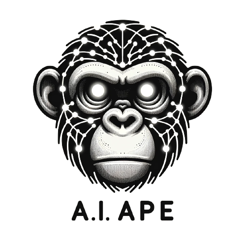

## Concise DINO Code:
___

<div style="background-image: url('./notebooks_/assets/imgs/bg4.png');">
    
    
<br>

#### <a style="color:#b8c6d9">Background:</a>
I've streamlined the DinoV2 code repository and integrated a wrapper for clarity. This allows you to easily understand the core mechanics of how the model functions, without being sidetracked by the complexities of distributed computing and other extraneous add-ons that obscure the model's primary operations.
<br><br>

#### <a style="color:#b8c6d9">Outline:</a>
```
    1. Dataloading an Augmentation
    2. Dino Model
    3. Training Methods
    4. Model Demo
```
<br><br>


#### <a style="color:#b8c6d9">Publications:</a>

<div style="margin-left: 30px;">
<a href="https://arxiv.org/pdf/2104.14294.pdf" style="color:#606e8a; text-decoration:none; border-bottom: 1px solid #606e8a;">‣ 2021 Emerging Properties in Self-Supervised Vision Transformers</a>
    
<a href="https://arxiv.org/abs/2304.07193" style="color:#606e8a; text-decoration:none; border-bottom: 1px solid #606e8a;">‣ 2023 DINOv2: Learning Robust Visual Features without Supervision</a>
    
</div>


<div style="position: relative; width: 850px;">
    
</div>

<br><br>
    
</div>
